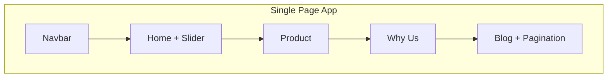

# DezyIt

A single-page marketing site for **[DezyIt](https://www.dezyit.com)** — a mobile app that guides teams through **Design Sprints** and **Design Thinking** workshops. The site introduces the product, explains the methodology, highlights differentiators, and surfaces blog content with app-store download links.

Built with **React 17** and **Create React App**, styled with **Bootstrap 5** and custom CSS.

---

## What this site is for

| Goal | How the app supports it |
|------|-------------------------|
| **Product awareness** | Hero, product screenshots, and store badges (Google Play & App Store) |
| **Education** | “What is a Design Sprint?” copy and imagery from the GV-style 5-day process |
| **Trust & differentiation** | “Why DezyIt?” — Collaboration, Creativity, Empathy |
| **Content marketing** | Blog card grid with **working pagination** driven by `CardData.js` |
| **Social proof** | Stats bar, testimonials, and FAQ accordion |
| **Lead capture** | Contact form and footer newsletter signup (client-side validation) |
| **Navigation** | Navbar + footer quick links with smooth in-page anchors |

This is a **landing / marketing site**, not an authenticated admin panel. It is ideal for portfolios, internship demos, and recruiter reviews when paired with a live deploy link and a short “what I built” note.

---

## Tech stack

| Layer | Technology |
|-------|------------|
| UI library | React 17 |
| Tooling | Create React App (`react-scripts` 4.x) |
| Layout & components | Bootstrap 5, React Bootstrap (Carousel) |
| Pagination | `react-js-pagination` |
| Icons | Font Awesome (CDN in `public/index.html`) |
| Styling | Component-scoped CSS + Bootstrap grid utilities |

---

## Project structure

```
src/
├── App.js                 # Root layout — composes all sections
├── index.js               # ReactDOM entry + Bootstrap CSS import
├── components/
│   ├── Navbar/            # Logo, hamburger menu, nav links
│   ├── Home/              # Hero, carousel, design sprint explainer
│   ├── product/           # Product copy + app mockups + download CTAs
│   ├── WhyUs/             # Three value pillars with alternating layout
│   ├── StatsBar/          # Key metrics strip
│   ├── Testimonials/      # User quotes and ratings
│   ├── FAQ/               # React Bootstrap accordion
│   ├── blog/              # Data-driven blog grid + pagination
│   ├── Contact/           # Validated contact form
│   └── Footer/            # Links, newsletter, store badges
└── images/                # Local WebP assets (optional; many URLs are remote)
```

---

## Components in use

### `Navbar`

- Responsive navigation with mobile toggle (`fas fa-bars` / `fa-times`).
- Menu config driven by `MenuItems.js` (Home, Product, Why Us?, Blogs, Contact).
- Anchor-based smooth scroll targets on the same page.

### `Home`

- **Hero (`sec1`)**: Headline, tagline, download CTAs, and `Slider` carousel.
- **`Slider`**: React Bootstrap `Carousel` cycling product screenshots (auto interval 1s).
- **`sec2`**: “What is a Design Sprint?” educational block with image + copy.

### `Product`

- Product description and three phone mockup images.
- Repeated Play Store / App Store download buttons.
- Note: `ImageSlider.js` exists as a carousel variant but is **not** wired into `product.js` today.

### `Why_us` (Why Us)

- Three sections: **Collaboration**, **Creativity**, **Empathy**.
- Alternating text/image layout (`div_2`, `div_3`) for visual rhythm.

### `StatsBar`

- Four highlight metrics (sprints, countries, rating, process length).

### `Testimonials`

- Three quote cards with star ratings and role labels.

### `FAQ`

- Five questions in a React Bootstrap `Accordion` (`#movetofaq`).

### `Blog`

- **`CardData.js`**: Nine blog posts; three per page.
- **`CardUI`**: Renders a single post from props.
- **`Cards`**: Maps the current page slice to cards.
- **`blog.js`**: `useState` + `react-js-pagination`; page changes scroll to the blog section.

### `Contact`

- Validated form (name, email, message) with success feedback (`#movetocontact`).

### `Footer`

- Quick links, app store badges, newsletter signup with email validation.

---

## Page order

`Navbar` → `Home` → `Product` → `Why Us` → `StatsBar` → `Testimonials` → `Blog` → `FAQ` → `Contact` → `Footer`

---

## Getting started

### Prerequisites

- **Node.js** 16+ (recommended: 16 LTS for CRA 4 compatibility)
- **npm** or **yarn**

### Install & run

```bash
npm install
npm start
```

Open [http://localhost:3000](http://localhost:3000).

### Production build

```bash
npm run build
```

`start` and `build` scripts set `NODE_OPTIONS=--openssl-legacy-provider` for **Node 17+** compatibility with CRA 4.

---

## Deploy (recommended for recruiters)

```bash
npm run build
npx serve -s build
```

Or deploy the `build/` folder to [Vercel](https://vercel.com), [Netlify](https://netlify.com), or GitHub Pages. Add the live URL and a screenshot to the Author section below.

### Optional next steps

| Idea | Notes |
|------|--------|
| Live demo URL | Highest impact for portfolio reviews |
| React Router | `/blog/:slug` for individual posts |
| Unit tests | Navbar toggle, contact validation, pagination |
| Dark mode | CSS variables + context |

---

## App flow (high level)



---

## Scripts

| Command | Description |
|---------|-------------|
| `npm start` | Dev server with hot reload |
| `npm test` | Jest + React Testing Library (watch mode) |
| `npm run build` | Optimized production bundle in `/build` |
| `npm run eject` | Eject CRA config (irreversible) |

---

## License & attribution

Marketing copy and images reference the official **DezyIt** brand and [dezyit.com](https://www.dezyit.com). Use this repository for learning and portfolio purposes; confirm branding rights if you deploy publicly.

---

## Author

Add your name, LinkedIn, and **live demo URL** here so recruiters can open the app in one click.

```markdown
**Your Name** — [LinkedIn](https://linkedin.com/in/your-profile) · [Live demo](https://your-deploy-url.vercel.app)
```
